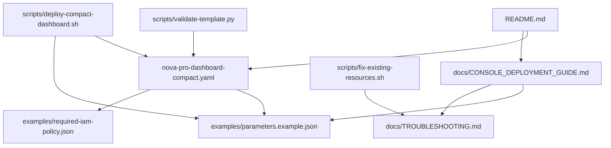

# Project Structure

```
nova-pro-cloudwatch-dashboard/
├── README.md                           # Main project documentation
├── LICENSE                             # MIT License
├── CHANGELOG.md                        # Version history and changes
├── CONTRIBUTING.md                     # Contribution guidelines
├── PROJECT_STRUCTURE.md               # This file - project organization
├── .gitignore                         # Git ignore patterns
│
├── nova-pro-dashboard-compact.yaml    # Main CloudFormation template
│
├── docs/                              # Documentation
│   ├── CONSOLE_DEPLOYMENT_GUIDE.md    # AWS Console deployment steps
│   ├── CUSTOMER_IAM_REQUIREMENTS.md   # IAM policy requirements
│   ├── CUSTOMER_DEPLOYMENT_SUMMARY.md # Quick deployment summary
│   ├── PRODUCTION_DEPLOYMENT_GUIDE.md # Production best practices
│   └── TROUBLESHOOTING.md             # Common issues and solutions
│
├── examples/                          # Example configurations
│   ├── README.md                      # Examples documentation
│   ├── parameters.example.json        # Basic parameter template
│   ├── parameters-unique.json         # Unique names example
│   └── required-iam-policy.json       # IAM policy template
│
└── scripts/                           # Utility scripts
    ├── README.md                      # Scripts documentation
    ├── validate-template.py           # Template validation
    ├── deploy-compact-dashboard.sh    # Automated deployment
    ├── fix-existing-resources.sh     # Resource conflict resolution
    ├── check-resource-ownership.sh   # Resource ownership checker
    └── assume-dashboard-role.sh       # Legacy role assumption helper
```

## 📁 Directory Descriptions

### Root Files
- **`nova-pro-dashboard-compact.yaml`** - The main CloudFormation template
- **`README.md`** - Primary project documentation with quick start guide
- **`LICENSE`** - MIT license for open source distribution
- **`CHANGELOG.md`** - Version history and release notes
- **`CONTRIBUTING.md`** - Guidelines for contributors
- **`.gitignore`** - Patterns for files to exclude from version control

### `/docs/` - Documentation
Comprehensive guides for different user types and scenarios:
- **Console users** - Step-by-step AWS Console instructions
- **CLI users** - Command-line deployment guides
- **Production deployments** - Best practices and security considerations
- **Troubleshooting** - Common issues and their solutions

### `/examples/` - Configuration Examples
Ready-to-use configuration files:
- **Parameter templates** - CloudFormation parameter examples
- **IAM policies** - Required permissions for dashboard access
- **Multiple scenarios** - Different deployment configurations

### `/scripts/` - Automation Tools
Utility scripts for deployment and management:
- **Validation** - Template and configuration validation
- **Deployment** - Automated deployment with error handling
- **Troubleshooting** - Diagnostic and resolution tools
- **Legacy support** - Backward compatibility helpers

## 🎯 Usage Patterns

### For End Users
1. **Start with** `README.md` for overview
2. **Follow** `docs/CONSOLE_DEPLOYMENT_GUIDE.md` for deployment
3. **Use** `examples/parameters.example.json` as template
4. **Reference** `docs/TROUBLESHOOTING.md` if issues arise

### For Developers
1. **Read** `CONTRIBUTING.md` for contribution guidelines
2. **Use** `scripts/validate-template.py` for testing
3. **Follow** project structure for new features
4. **Update** documentation with changes

### For Automation
1. **Use** `scripts/deploy-compact-dashboard.sh` for CI/CD
2. **Customize** `examples/parameters.example.json` for environments
3. **Integrate** validation scripts in pipelines
4. **Monitor** `CHANGELOG.md` for breaking changes

## 🔄 File Relationships



## 📋 Maintenance

### Regular Updates
- **Template** - Update for new AWS features and pricing
- **Documentation** - Keep deployment guides current
- **Examples** - Add new use cases and configurations
- **Scripts** - Improve automation and error handling

### Version Control
- **Tag releases** with semantic versioning
- **Update CHANGELOG.md** with each release
- **Maintain backward compatibility** when possible
- **Document breaking changes** clearly

### Quality Assurance
- **Validate templates** before commits
- **Test deployment scripts** in multiple environments
- **Review documentation** for accuracy
- **Check links and references** regularly

## 🚀 Getting Started

### Quick Start
```bash
# Clone the repository
git clone https://github.com/your-org/nova-pro-dashboard.git
cd nova-pro-dashboard

# Validate the template
python3 scripts/validate-template.py nova-pro-dashboard-compact.yaml

# Deploy via console (recommended for first-time users)
# Follow docs/CONSOLE_DEPLOYMENT_GUIDE.md

# Or deploy via CLI
./scripts/deploy-compact-dashboard.sh
```

### Development Setup
```bash
# Make scripts executable
chmod +x scripts/*.sh

# Install Python dependencies
pip install pyyaml

# Validate project structure
ls -la
```

This structure provides clear separation of concerns while maintaining ease of use for different user types and scenarios.